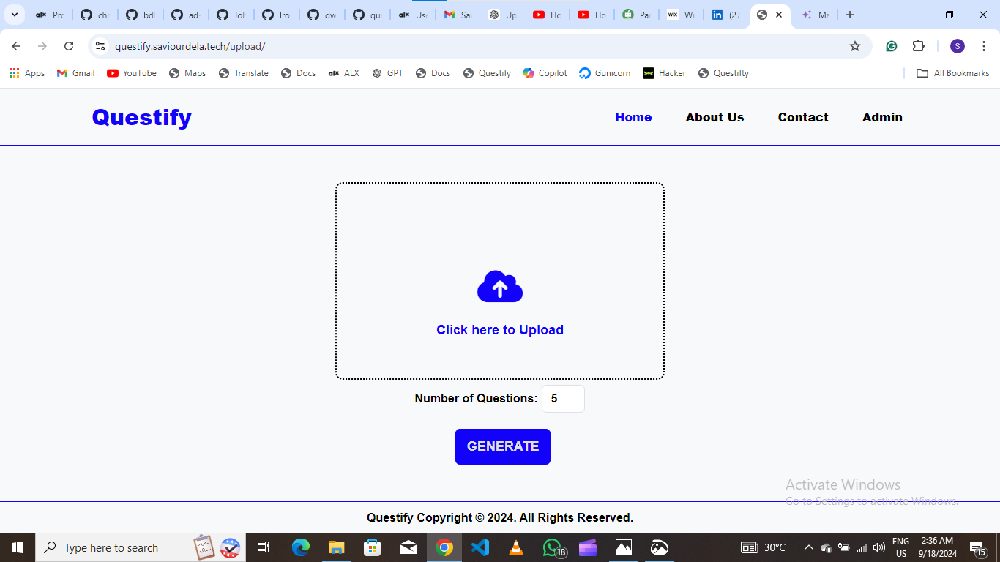
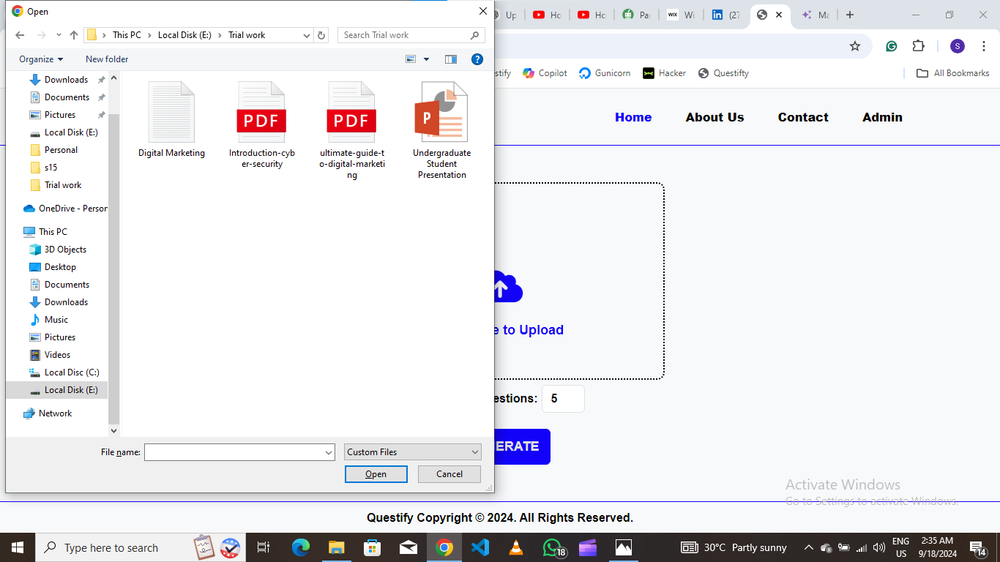
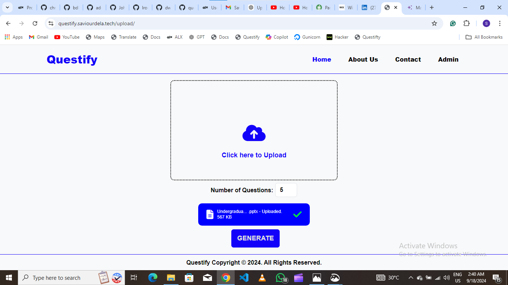
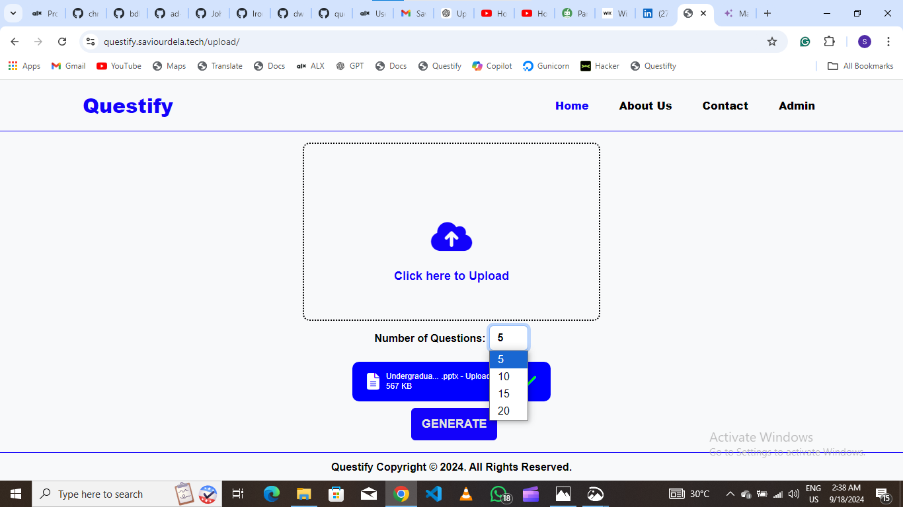
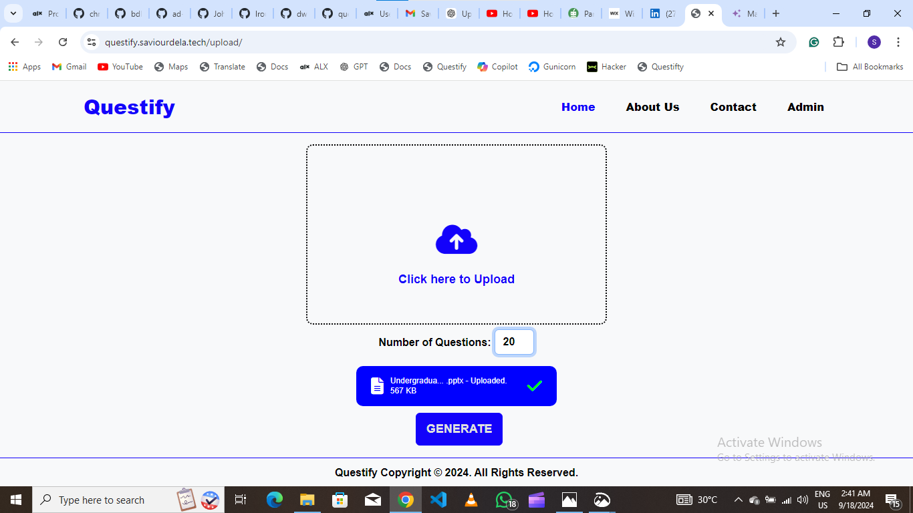
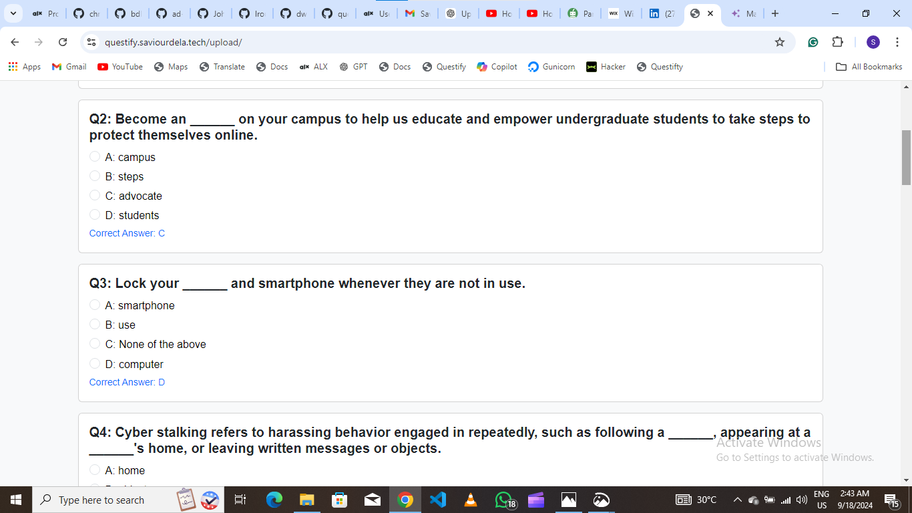

# Questify

## Table of Content

## Introduction
 ### The Project
 Questify is a web app that simplifies quiz creation for students and educators by generating multiple-choice questions (MCQs) from uploaded course materials, including PDFs, text files, and slide presentations. It uses text extraction algorithms to analyze the content and generate random MCQs, with each question including four answer options and a correct answer, providing an engaging learning experience.
  
 ### Inspiration
As a student at the Kwame Nkrumah University of Science and Technology (KNUST), specifically during my third and final year at the School of Business, I faced a significant challenge that many students could relate to: the limited access to past exam questions. This limitation left me relying solely on the materials provided by lecturers, which made it difficult to assess my understanding of the topics I studied fully. Without the opportunity to practice with real exam questions, I felt unprepared for the kinds of questions I would face in exams

This experience drove me to take action and create a solution not just for myself, but for other students as well. I developed Questify, a web application designed to bridge this gap by offering students easy access to a platform where they can generate and practice multiple-choice questions. My goal is to provide students at KNUST and beyond with the tools they need to test and strengthen their understanding of the material truly, ultimately making learning more effective and accessible for all.
 
 ### The Context
This is my Portfolio Project, concluding my Foundations Year at Holberton School. I chose what I wanted to work on, as long as I presented a working program at the end of the development stage.
 
### Links
Visit the **live site**: [Questify Web App](https://questify.saviourdela.tech/)
 
Final project **blog**: [Questify - The Journey](#)
 
Connect with the author on **LinkedIn**: [Saviour Assandoh](https://www.linkedin.com/in/saviour-assandoh/)
 
## Installation

## Usage
1. **Upload a File**:
   To begin creating multiple-choice questions (MCQs), click anywhere within the rectangular area marked by a black dashed line. This will open a file explorer window where you can select and upload your study materials. Questify supports files with the following extensions: `.pdf`, `.txt`, and `.pptx`. These formats are commonly used for course materials like textbooks, lecture notes, and slide presentations.
    
    
   
    
    
   
    
    

3. **Select the Number of Questions**:
   Once your file is uploaded, you will be prompted to select how many MCQs you would like to generate. The system offers preset options, allowing you to choose between 5, 10, 15, or 20 questions. Simply select the number that fits your quiz or exam requirements. This option helps to customize the length of the quiz based on the depth of content you need.
    
    
   
    
    
   
    
    

5. **Generate the MCQs**:
   After selecting the desired number of questions, click the **Generate** button. Questify will automatically analyze the content of the uploaded file, extract key information, and generate a set of multiple-choice questions (MCQs) based on the text. Each question will be accompanied by four possible answer choices (A, B, C, and D), with one correct answer identified. This process is quick and ensures that the questions are relevant to the content you've uploaded, saving you time and effort.
    
    
   
    
    
   
    
    
## Contribution
Saviour Assandoh is the only contributor at this time

## Related projects
Here is the [repo](https://github.com/Saviour99/) with all my projects.

## Licensing
This project is licensed under the MIT License - see the LICENSE file for details.

